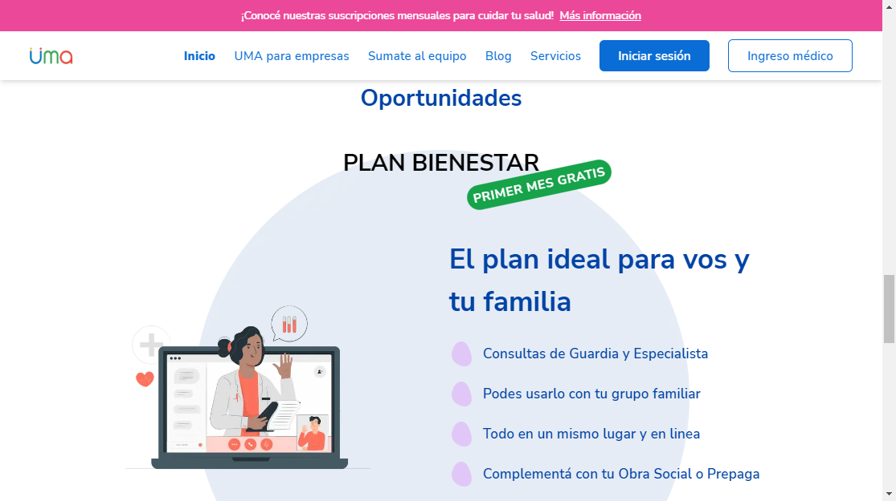
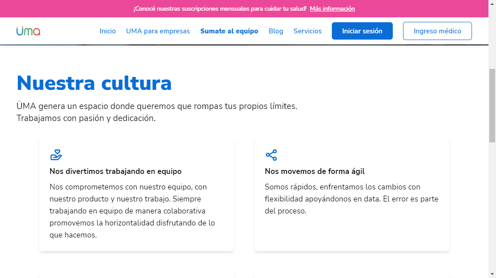
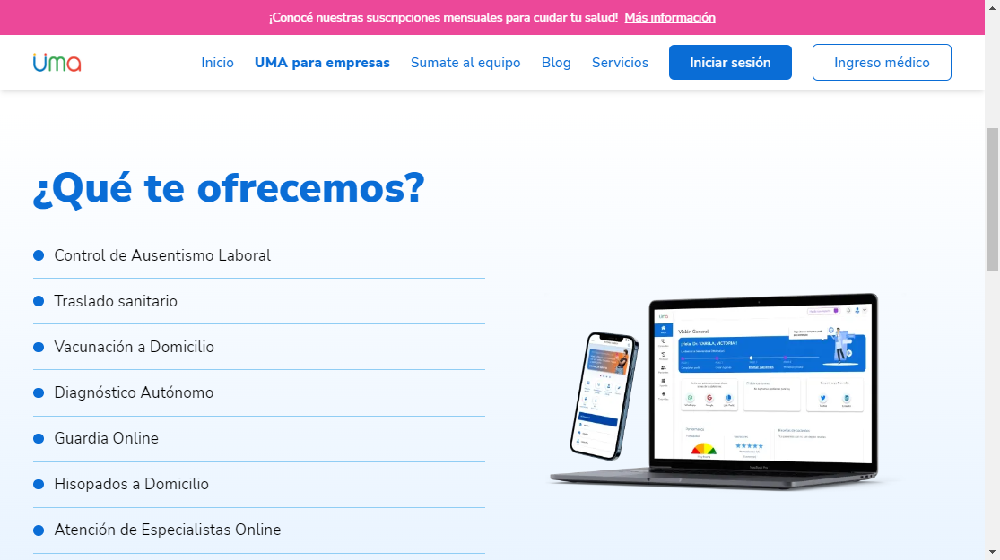

# UMA Clon
UMA Page UI Clon

## Installation
1. Clone a copy of the repository to your local machine.
```bash
git clone git@github.com:ariel96carp/uma-clon.git
```

2. Use the package npm to install dependencies.
```bash
npm i
```

3. Run this repository on local environment.
```bash
npm run dev
```

4. *[optional]* You can build a dist with the command:
```bash
npm run build
```

## Overview










## Deploy
[https://dante-uma-clon.netlify.app/](https://dante-uma-clon.netlify.app/)

## Technologies Used
[React](https://es.reactjs.org/)..
[Vite](https://vitejs.dev/)..
[ESLint](https://eslint.org/)..
[TailwindCSS](https://tailwindcss.com/)

## Libraries Used
[React Router](https://reactrouter.com/en/main)..
[Formik](https://formik.org/)..
[Prop-Types](https://github.com/facebook/prop-types)..
[Pure React Carousel](https://github.com/facebook/prop-types)..
[React Accessible Accordion](https://github.com/springload/react-accessible-accordion)